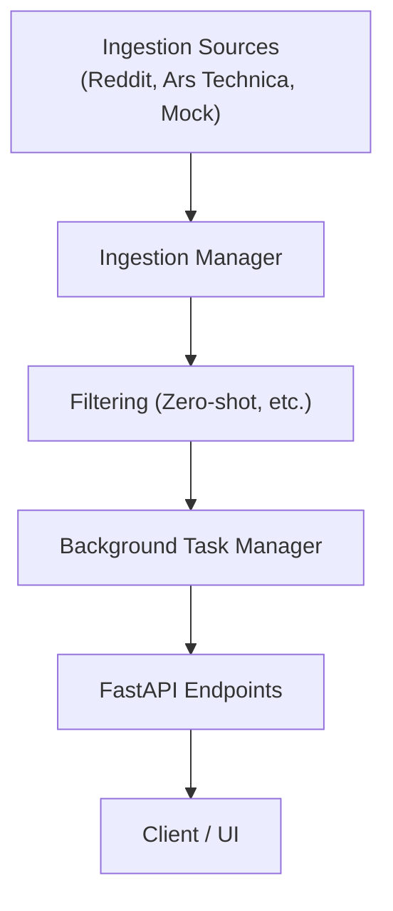

# IT Newsfeed

[](https://github.com/UmbertoTomasini/IT_newsfeed/actions/workflows/ci.yml)

*A FastAPI-based aggregator for for company IT managers. It features modular ingestion, relevance filtering and relevancy x recency scoring.*

---

## 🚀 Installation

```bash
git clone https://github.com/UmbertoTomasini/IT_newsfeed.git
cd IT_newsfeed
python3 -m venv venv && source venv/bin/activate
pip install -r requirements.txt
```

---

## ▶️ Local Run

```bash
uvicorn newsfeed.main:app --reload
```
- Visit [http://127.0.0.1:8000/docs](http://127.0.0.1:8000/docs) for the interactive API.

---

## 🏗️ Architecture Overview



- **Ingestion Sources:** Fetch news from multiple sources.
- **Ingestion Manager:** Orchestrates fetching and deduplication.
- **Filtering:** Applies relevance and recency filters.
- **Background Task Manager:** Handles periodic ingestion and scoring.
- **FastAPI Endpoints:** `/ingest`, `/retrieve`, `/retrieve-all`, etc.

---

## 🧪 Running Tests

```bash
pytest
```

- Lint and format:
  ```bash
  black . && isort . && ruff check .
  ```

---

## ⚙️ Configuration

| Variable                          | Description                                              | Default      |
|------------------------------------|----------------------------------------------------------|--------------|
| `MIN_SCORE`                       | Min relevance score for filtering                        | `0.08`       |
| `MAX_ITEMS`                       | Max news items to keep in memory                         | `100`        |
| `INTERVAL`                        | Ingestion interval (seconds)                             | `30`         |
| `NUMBER_INITIAL_POST_PER_SOURCE`   | Initial posts per source                                 | `5`          |
| `PERSISTENCE_TIME`                | Recency decay time (seconds)                             | `86400`      |
| `ASSESS_CORRECTNESS_WITH_BIGGER_MODEL` | Enable assessment with larger model                 | `True`       |
| `ASSESS_EFFICIENCY`               | Enable efficiency metrics                                | `True`       |

See [`newsfeed/config.py`](newsfeed/config.py) for details.

---

## 📄 License

MIT

---
