# Newsfeed

*A FastAPI‑based news‑aggregation service for corporate IT managers.*
*It features modular ingestion, relevance filtering, and a **************************************relevance × recency************************************** scoring pipeline.*

---

## 🚀 Installation

```bash
git clone https://github.com/UmbertoTomasini/newsfeed.git
python3 -m venv newsfeed/venv
source newsfeed/venv/bin/activate
pip install -r newsfeed/requirements.txt
```

> **Tip** You never `cd` inside the repo in these commands, so everything works from the directory where you ran the clone.

---

## ▶️ Quick start (local)

> The pipeline first **aggregates IT news** from multiple sources,
> **filters** items relevant to IT managers, then **continuously** fetches new items and rescores them in the background.
> See [Architecture & design](#architecture--design) for the rationale.

### 0 Activate the virtual‑env (if not already)

```bash
source newsfeed/venv/bin/activate
```

### 1 Start the API server

```bash
uvicorn newsfeed.main:app --reload          # ➜ http://127.0.0.1:8000
# Ctrl‑C to stop
```

Open **[http://127.0.0.1:8000/docs](http://127.0.0.1:8000/docs)** for Swagger UI.

### 2 Terminal UI – read the feed

```bash
python -m newsfeed.show_news
```

Items are sorted by **relevance × recency**.

### 3 Synthetic ingestion & retrieval (REST)

```bash
# ingest one synthetic item
curl -X POST http://127.0.0.1:8000/ingest \
  -H 'Content-Type: application/json' \
  -d '[{"id":"test-1","source":"synthetic","title":"Test Event",\
        "body":"Synthetic test event.","published_at":"2024-07-15T10:00:00Z"}]'

# fetch what the filter accepted
curl http://127.0.0.1:8000/retrieve | jq .
```

| Verb   | Path            | Purpose                                                  |
| ------ | --------------- | -------------------------------------------------------- |
| `POST` | `/ingest`       | Push raw items (array)                                   |
| `GET`  | `/retrieve`     | Return *accepted* items, sorted by relevance × recency   |
| `GET`  | `/retrieve-all` | Debug: accepted + rejected + evaluation from a large LLM |

---

## 🏗️ Architecture & design

```mermaid
flowchart TD
    src["Aggregation<br/>(Reddit Sysadmin, Reddit Outages, Reddit Cybersec, Ars‑Technica, Mock)"] --> mgr["Ingestion Manager"]
    mgr --> hf["Hard Filter<br/>BART‑MNLI (zero‑shot)"]
    hf --> rec["Recency Weighting<br/>exp(-Δt / PERSISTENCE_TIME)"]
    rec --> mem["In‑memory Store<br/>(≤ MAX_ITEMS)"]
    subgraph Background
        timer["Background Task Manager<br/>runs every INTERVAL s"] --> mgr
    end
    mem --> api["FastAPI Endpoints"]
    api --> ui["Terminal UI / REST client"]
```



| Stage                       | What happens                                                                                                                                                                                                                                                                                                                                               | Key **config.py** knobs                             |
| --------------------------- | ---------------------------------------------------------------------------------------------------------------------------------------------------------------------------------------------------------------------------------------------------------------------------------------------------------------------------------------------------------- | --------------------------------------------------- |
| **Aggregation**             | Each source fetches `NUMBER_INITIAL_POST_PER_SOURCE` items and normalises them into `NewsItem` objects (`id`, `source`, `title`, `body`, `published_at`, …).                                                                                                                                                                                               | `NUMBER_INITIAL_POST_PER_SOURCE`, `INTERVAL`        |
| **Ingestion manager**       | Deduplicates on `id`, stamps metadata, pushes batch to filter.                                                                                                                                                                                                                                                                                             | —                                                   |
| **Hard filter**             | `facebook/bart‑large‑mnli` zero‑shot classifier checks *title + first 2 sentences* against a specialised label set (see below). Item is accepted if **any** label score ≥ `MIN_SCORE`. Rejected items are stored *only* when `ASSESS_CORRECTNESS_WITH_BIGGER_MODEL=True`.                                                                                  | `MIN_SCORE`, label list in `ingestion/filtering.py` |
| **Recency weighting**       | Compute `recency_weight = exp(-Δt / PERSISTENCE_TIME)` and save `final_score = relevance_score × recency_weight`.                                                                                                                                                                                                                                          | `PERSISTENCE_TIME`                                  |
| **In-memory store**         | Keep accepted items up to `MAX_ITEMS`; older items drop off.                                                                                                                                                                                                                                                                                               | `MAX_ITEMS`                                         |
| **Background Task Manager** | Async loop fetches new items every `INTERVAL` seconds, re‑applies the filter & scoring.                                                                                                                                                                                                                                                                    | `INTERVAL`                                          |
| **API / UI**                | FastAPI exposes `/ingest`, `/retrieve`, `/retrieve-all`; by default the TUI (`python -m newsfeed.show_news`) calls `/retrieve`, which recomputes recency weights. If `ASSESS_CORRECTNESS_WITH_BIGGER_MODEL=True`, the TUI instead calls `/retrieve-all`, receives *all* items (accepted + rejected) and then performs live evaluation with a larger model. | —                                                   |

> **Configuration note** All parameters in **CAPS** above live in [`newsfeed/config.py`](newsfeed/config.py). Edit them there to change thresholds, intervals, or feature‑flags.

### Classifier label set & decision rule

| Bucket           | Labels                                                                                                  |
| ---------------- | ------------------------------------------------------------------------------------------------------- |
| **Relevant**     | `Outage`, `Security Incident`, `Vulnerability`, `Major Bug`, *(plus 8 more nuanced operational labels)* |
| **Not relevant** | `Not a critical/urgent issue for an IT manager of a company`                                            |

* The label list is intentionally **skewed toward relevant classes** to minimise false‑negatives, which matter more than false‑positives in this setting.
* The classifier runs in **multi‑label** mode (`multi_label=True`). If *any* label’s probability ≥ `MIN_SCORE`, the item is accepted; otherwise rejected.
* **Recall / latency trade‑off** – more labels boost recall but increase inference latency. 

  1. `relevance_score` → the *max* label probability.
  2. `top_relevant_label` → the label that produced that score.

Rejected items are only persisted when `ASSESS_CORRECTNESS_WITH_BIGGER_MODEL=True` so that a larger model can later reassess them for offline metrics.

---

\*\* All parameters in **CAPS** above live in [`newsfeed/config.py`](newsfeed/config.py). Edit them there to change thresholds, intervals, or feature‑flags.

---

## 👓 Evaluation of efficiency & correctness (bonus)

### Correctness

1. **Offline metrics (custom dataset)** – a dataset with 20 examples was created and labelled with **OpenAI o3** stored in `newsfeed/tests/test_cases_relevant.json` .&#x20;

   With `MIN_SCORE = 0.08`, `facebook/bart‑large‑mnli` achieves **100 % precision and recall** on this set (see `tests/test_hard_filtering_relevant.py`).
2. **Live evaluation (larger LLM)** – when `ASSESS_CORRECTNESS_WITH_BIGGER_MODEL=True`, the TUI calls `/retrieve-all` and re‑scores every item with `tiiuae/falcon‑7b‑instruct` (open‑source, ungated). Falcon‑7B still produces many false‑positives, worse than `facebook/bart‑large‑mnli` .

### Efficiency

* Latency, throughput, CPU and (if present) GPU usage are measured **per pipeline step**.
* Metrics are appended to timestamped files under `logs/efficiency/` when `ASSESS_EFFICIENCY=True` in `config.py`.

## 🧪 Testing & verification

> **Goal** Guarantee that the pipeline is correct, reproducible, and fast enough for real‑time use.

| Test file                               | Kind                       | What it checks                                                                                                                                                                                                                   | Command                                           |
| --------------------------------------- | -------------------------- | -------------------------------------------------------------------------------------------------------------------------------------------------------------------------------------------------------------------------------- | ------------------------------------------------- |
| `tests/test_aggregation_pipeline.py`    | **Integration**            | • Root endpoint 200 OK.<br>• `/ingest` ACK & items land in memory.<br>• `/retrieve` orders by recency.<br>• Dedup prevents duplicate IDs.<br>• IngestionManager pulls new items from `MockSource` and `/retrieve` reflects them. | `pytest tests/test_aggregation_pipeline.py -q`    |
| `tests/test_efficiency_logging.py`      | **Smoke / Performance**    | • Basic 200 responses for `/`, `/retrieve`, `/retrieve-all`.<br>• `/ingest` ACK round‑trip.<br>• Ensures endpoints stay alive when efficiency logging is on.                                                                     | `pytest tests/test_efficiency_logging.py -q`      |
| `tests/test_hard_filtering_relevant.py` | **Unit / Offline metrics** | • Runs `zero_shot_it_relevance_filter` on a 20‑item custom dataset.<br>• Prints confusion matrix, precision, recall; asserts perfect P\&R at `MIN_SCORE=0.08`.                                                                   | `pytest tests/test_hard_filtering_relevant.py -q` |

### Coverage & lint helpers

```bash
pytest --cov=newsfeed --cov-report=term-missing   # statement coverage
pre-commit run --all-files                        # Black, isort, Ruff
```

A coverage badge can be added once the project is public:

```md
[](#)
```

CI (`.github/workflows/ci.yml`) executes **pytest** (+ coverage) on Python 3.10 & 3.11 and enforces style via **Black · isort · Ruff**.

---

## 📝 Logging

| Log file folder    | What it captures                                                                                                                                                      | When enabled                                                     |
| ------------------ | --------------------------------------------------------------------------------------------------------------------------------------------------------------------- | ---------------------------------------------------------------- |
| `logs/items/`      | **Accepted & refused item IDs, titles, sources** plus a tag indicating whether the event happened during the initial startup ingestion or a background refresh cycle. | Always—written by `log_utils` whenever an item decision is made. |
| `logs/efficiency/` | JSON lines with *timestamp, stage name, latency (s), throughput (items/s), CPU %, GPU %*                                                                              | Only when `ASSESS_EFFICIENCY=True` in `config.py`.               |

These logs let you audit relevance decisions and spot performance regressions without rerunning the pipeline.

---

## ⚙️ Configuration

| Variable                               | Description                        | Default |
| -------------------------------------- | ---------------------------------- | ------- |
| `MIN_SCORE`                            | Minimum relevance score to accept  | `0.08`  |
| `MAX_ITEMS`                            | Max items kept in memory           | `100`   |
| `INTERVAL`                             | Ingestion interval (s)             | `30`    |
| `NUMBER_INITIAL_POST_PER_SOURCE`       | Seed items per source              | `5`     |
| `PERSISTENCE_TIME`                     | Recency decay constant (s)         | `86400` |
| `ASSESS_CORRECTNESS_WITH_BIGGER_MODEL` | Run offline eval with larger model | False   |
| `ASSESS_EFFICIENCY`                    | Log latency & throughput           | `True`  |

See [`newsfeed/config.py`](newsfeed/config.py) for full commentary.

---

## 📄 License

MIT
