# Newsfeed

*A FastAPI‑based news‑aggregation service for corporate IT managers.*
*It features modular ingestion, relevance filtering, and a ******relevance × recency****** scoring pipeline.*

---

## 🚀 Installation

```bash
git clone https://github.com/UmbertoTomasini/newsfeed.git
python3 -m venv newsfeed/venv
source newsfeed/venv/bin/activate
pip install -r newsfeed/requirements.txt
```

> **Tip** You never `cd` inside the repo in these commands, so everything works from the directory where you ran the clone.

---

## ▶️ Quick start (local)

> The pipeline first **aggregates IT news** from multiple sources,
> **filters** items relevant to IT managers, then **continuously** fetches new items and rescores them in the background.
> See [Architecture & design](#architecture--design) for the rationale.

### 0 Activate the virtual‑env (if not already)

```bash
source newsfeed/venv/bin/activate
```

### 1 Start the API server

```bash
uvicorn newsfeed.main:app --reload          # ➜ http://127.0.0.1:8000
# Ctrl‑C to stop
```

Open **[http://127.0.0.1:8000/docs](http://127.0.0.1:8000/docs)** for Swagger UI.

### 2 Terminal UI – read the feed

```bash
python -m newsfeed.show_news
```

Items are sorted by **relevance × recency**.

### 3 Synthetic ingestion & retrieval (REST)

```bash
# ingest one synthetic item
curl -X POST http://127.0.0.1:8000/ingest \
  -H 'Content-Type: application/json' \
  -d '[{"id":"test-1","source":"synthetic","title":"Test Event",\
        "body":"Synthetic test event.","published_at":"2024-07-15T10:00:00Z"}]'

# fetch what the filter accepted
curl http://127.0.0.1:8000/retrieve | jq .
```

| Verb   | Path            | Purpose                                                  |
| ------ | --------------- | -------------------------------------------------------- |
| `POST` | `/ingest`       | Push raw items (array)                                   |
| `GET`  | `/retrieve`     | Return *accepted* items, sorted by relevance × recency   |
| `GET`  | `/retrieve-all` | Debug: accepted + rejected + evaluation from a large LLM |

---

## 🏗️ Architecture & design

```mermaid
flowchart TD
    A["Ingestion Sources<br/>(Reddit, Ars Technica, Mock)"] --> B["Ingestion Manager"]
    B --> C["Filtering (Zero‑shot, etc.)"]
    C --> D["Background Task Mgr"]
    D --> E["FastAPI Endpoints"]
    E --> F["Client / UI"]
```



| Layer                       | Key decisions & assumptions                                                                                                           |
| --------------------------- | ------------------------------------------------------------------------------------------------------------------------------------- |
| **Ingestion sources**       | Each source lives in its own class so new feeds (RSS, Twitter, etc.) drop in without touching core logic.                             |
| **Ingestion manager**       | *Single rendez‑vous* that deduplicates on `item.id`, injects metadata, and batches hand‑offs to the filter.                           |
| **Filtering**               | Zero‑shot model + regex fallback → good precision without source‑specific tuning. Recency decay (`exp(-Δt/τ)`) merged to final score. |
| **Background task manager** | Runs ingestion every `INTERVAL` s with `asyncio` to avoid blocking API threads. Keeps memory use ≤ `MAX_ITEMS`.                       |
| **API layer (FastAPI)**     | Thin CRUD wrapper so other services (Slack bot, dashboard) reuse the same business logic.                                             |
| **In‑memory store**         | Simpler than a DB for take‑home; assumption: ≤ 100 items fits RAM. Swappable for Redis if persistence is required.                    |

---

## 🧪 Testing & verification

| Level           | What’s covered                                                            | How to run                      |
| --------------- | ------------------------------------------------------------------------- | ------------------------------- |
| **Unit**        | Ingestion adapters, `filtering.score()`, recency decay                    | `pytest tests/unit -q`          |
| **Integration** | End‑to‑end pipeline with mock sources → `/retrieve`                       | `pytest tests/integration -q`   |
| **Performance** | Latency / throughput logged via `log_utils` when `ASSESS_EFFICIENCY=True` | Inspect `logs/efficiency/*.log` |

The CI workflow (`.github/workflows/ci.yml`) runs **pytest** on Python 3.10 & 3.11 and enforces code health with **Black + isort + Ruff**.

---

## 👓 Evaluation of efficiency & correctness&#x20;

### Correctness

1. **Offline metrics** – precision, recall, and a full confusion‑matrix are computed on a custom‑labelled dataset (`tests/test_hard_filtering_relevant.py`).
2. **Live evaluation** – run `python -m newsfeed.show_news` with `ASSESS_CORRECTNESS_WITH_BIGGER_MODEL=True` to stream items through a larger LLM and compare its classification to the pipeline in real time.

### Efficiency

* Latency, throughput, CPU and (if present) GPU usage are measured **per pipeline step**.
* Results are appended to timestamped files under `logs/efficiency/` when `ASSESS_EFFICIENCY=True` in `config.py`.

---

## ⚙️ Configuration

| Variable                               | Description                        | Default |
| -------------------------------------- | ---------------------------------- | ------- |
| `MIN_SCORE`                            | Minimum relevance score to accept  | `0.08`  |
| `MAX_ITEMS`                            | Max items kept in memory           | `100`   |
| `INTERVAL`                             | Ingestion interval (s)             | `30`    |
| `NUMBER_INITIAL_POST_PER_SOURCE`       | Seed items per source              | `5`     |
| `PERSISTENCE_TIME`                     | Recency decay constant (s)         | `86400` |
| `ASSESS_CORRECTNESS_WITH_BIGGER_MODEL` | Run offline eval with larger model | `True`  |
| `ASSESS_EFFICIENCY`                    | Log latency & throughput           | `True`  |

See [`newsfeed/config.py`](newsfeed/config.py) for full commentary.

---

## 📄 License

MIT
