# Newsfeed

*A FastAPI‑based news‑aggregation service for corporate IT managers.*
*It features modular ingestion, relevance filtering, and a ****relevance × recency**** scoring pipeline.*

---

## 🚀 Installation

```bash
git clone https://github.com/UmbertoTomasini/newsfeed.git
python3 -m venv newsfeed/venv
source newsfeed/venv/bin/activate
pip install -r newsfeed/requirements.txt
```

> **Tip** You never `cd` inside the repo in these commands, so everything works from the directory where you ran the clone.

---

## ▶️ Quick start (local)

> The pipeline first **aggregates IT news** from multiple sources,
> **filters** items relevant to IT managers, then **continuously** fetches new items and rescores them in the background.
> See [Architecture & design](#architecture--design) for the rationale.

### 0 Activate the virtual‑env (if not already)

```bash
source newsfeed/venv/bin/activate
```

### 1 Start the API server

```bash
uvicorn newsfeed.main:app --reload          # ➜ http://127.0.0.1:8000
# Ctrl‑C to stop
```

Open [**http://127.0.0.1:8000/docs**](http://127.0.0.1:8000/docs) for Swagger UI.

### 2 Terminal UI – read the feed

```bash
python -m newsfeed.show_news
```

Items are sorted by **relevance × recency**.

### 3 Synthetic ingestion & retrieval (REST)

```bash
# ingest one synthetic item
curl -X POST http://127.0.0.1:8000/ingest \
  -H 'Content-Type: application/json' \
  -d '[{"id":"test-1","source":"synthetic","title":"Test Event",\
        "body":"Synthetic test event.","published_at":"2024-07-15T10:00:00Z"}]'

# fetch what the filter accepted
curl http://127.0.0.1:8000/retrieve | jq .
```

| Verb   | Path            | Purpose                                                  |
| ------ | --------------- | -------------------------------------------------------- |
| `POST` | `/ingest`       | Push raw items (array)                                   |
| `GET`  | `/retrieve`     | Return *accepted* items, sorted by relevance × recency   |
| `GET`  | `/retrieve-all` | Debug: accepted + rejected + evaluation from a large LLM |

---

## 🏗️ Architecture & design

```mermaid
flowchart TD
    src["Aggregation<br/>(Reddit Sysadmin, Reddit Outages, Reddit Cybersec, Ars‑Technica, Mock)"] --> mgr["Ingestion Manager"]
    mgr --> hf["Hard Filter<br/>BART‑MNLI (zero‑shot)"]
    hf --> rec["Recency Weighting<br/>exp(-Δt / PERSISTENCE_TIME)"]
    rec --> mem["In‑memory Store<br/>(≤ MAX_ITEMS)"]
    subgraph Background
        timer["Background Task Manager<br/>runs every INTERVAL s"] --> mgr
    end
    mem --> api["FastAPI Endpoints"]
    api --> ui["Terminal UI / REST client"]
```



| Stage                       | What happens                                                                                                                                                                                                                                                                                                                                               | Key **config.py** knobs                             |
| --------------------------- | ---------------------------------------------------------------------------------------------------------------------------------------------------------------------------------------------------------------------------------------------------------------------------------------------------------------------------------------------------------- | --------------------------------------------------- |
| **Aggregation**             | Each source fetches `NUMBER_INITIAL_POST_PER_SOURCE` items and normalises them into `NewsItem` objects (`id`, `source`, `title`, `body`, `published_at`, …).                                                                                                                                                                                               | `NUMBER_INITIAL_POST_PER_SOURCE`, `INTERVAL`        |
| **Ingestion manager**       | Deduplicates on `id`, stamps metadata, pushes batch to filter.                                                                                                                                                                                                                                                                                             | —                                                   |
| **Hard filter**             | `facebook/bart‑large‑mnli` zero‑shot classifier checks *title + first 2 sentences* against a specialised label set (see below). Item is accepted if **any** label score ≥ `MIN_SCORE`. Rejected items are stored *only* when `ASSESS_CORRECTNESS_WITH_BIGGER_MODEL=True`.                                                                                  | `MIN_SCORE`, label list in `ingestion/filtering.py` |
| **Recency weighting**       | Compute `recency_weight = exp(-Δt / PERSISTENCE_TIME)` and save `final_score = relevance_score × recency_weight`.                                                                                                                                                                                                                                          | `PERSISTENCE_TIME`                                  |
| **In-memory store**         | Keep accepted items up to `MAX_ITEMS`; older items drop off.                                                                                                                                                                                                                                                                                               | `MAX_ITEMS`                                         |
| **Background Task Manager** | Async loop fetches new items every `INTERVAL` seconds, re‑applies the filter & scoring.                                                                                                                                                                                                                                                                    | `INTERVAL`                                          |
| **API / UI**                | FastAPI exposes `/ingest`, `/retrieve`, `/retrieve-all`; by default the TUI (`python -m newsfeed.show_news`) calls `/retrieve`, which recomputes recency weights. If `ASSESS_CORRECTNESS_WITH_BIGGER_MODEL=True`, the TUI instead calls `/retrieve-all`, receives *all* items (accepted + rejected) and then performs live evaluation with a larger model. | —                                                   |

> **Configuration note** All parameters in **CAPS** above live in [`newsfeed/config.py`](newsfeed/config.py). Edit them there to change thresholds, intervals, or feature‑flags.

### Classifier label set & decision rule

| Bucket           | Labels                                                                                                  |
| ---------------- | ------------------------------------------------------------------------------------------------------- |
| **Relevant**     | `Outage`, `Security Incident`, `Vulnerability`, `Major Bug`, *(plus 8 more nuanced operational labels)* |
| **Not relevant** | `Not a critical/urgent issue for an IT manager of a company`                                            |

* The label list is intentionally **skewed toward relevant classes** to minimise false‑negatives, which matter more than false‑positives in this setting.
* The classifier runs in **multi‑label** mode (`multi_label=True`). If *any* label’s probability ≥ `MIN_SCORE`, the item is accepted; otherwise rejected.
* **Recall / latency trade‑off** – more labels boost recall but increase inference latency. The current list was chosen as the sweet‑spot observed in benchmarking.
* For every processed item we store:

  1. `relevance_score` → the *max* label probability.
  2. `top_relevant_label` → the label that produced that score.

Rejected items are only persisted when `ASSESS_CORRECTNESS_WITH_BIGGER_MODEL=True` so that a larger model can later reassess them for offline metrics.

---

\*\* All parameters in **CAPS** above live in [`newsfeed/config.py`](newsfeed/config.py). Edit them there to change thresholds, intervals, or feature‑flags.

---

## 🧪 Testing & verification

| Level       | What’s covered                                                            | How to run                      |
| ----------- | ------------------------------------------------------------------------- | ------------------------------- |
| Unit        | Ingestion adapters, `filtering.score()`, recency decay                    | `pytest tests/unit -q`          |
| Integration | End‑to‑end pipeline with mock sources → `/retrieve`                       | `pytest tests/integration -q`   |
| Performance | Latency / throughput logged via `log_utils` when `ASSESS_EFFICIENCY=True` | Inspect `logs/efficiency/*.log` |

The CI workflow (`.github/workflows/ci.yml`) runs **pytest** on Python 3.10 & 3.11 and enforces code health with **Black + isort + Ruff**.

---

## 👓 Evaluation of efficiency & correctness 

### Correctness

1. **Offline metrics** – precision, recall, and a full confusion‑matrix are computed on a custom‑labelled dataset (`tests/test_hard_filtering_relevant.py`).
2. **Live evaluation** – run `python -m newsfeed.show_news` with `ASSESS_CORRECTNESS_WITH_BIGGER_MODEL=True` to stream items through a larger LLM and compare its classification to the pipeline in real time.

### Efficiency

* Latency, throughput, CPU and (if present) GPU usage are measured **per pipeline step**.
* Results are appended to timestamped files under `logs/efficiency/` when `ASSESS_EFFICIENCY=True` in `config.py`.

---

## ⚙️ Configuration

| Variable                               | Description                        | Default |
| -------------------------------------- | ---------------------------------- | ------- |
| `MIN_SCORE`                            | Minimum relevance score to accept  | `0.08`  |
| `MAX_ITEMS`                            | Max items kept in memory           | `100`   |
| `INTERVAL`                             | Ingestion interval (s)             | `30`    |
| `NUMBER_INITIAL_POST_PER_SOURCE`       | Seed items per source              | `5`     |
| `PERSISTENCE_TIME`                     | Recency decay constant (s)         | `86400` |
| `ASSESS_CORRECTNESS_WITH_BIGGER_MODEL` | Run offline eval with larger model | False   |
| `ASSESS_EFFICIENCY`                    | Log latency & throughput           | `True`  |

See [`newsfeed/config.py`](newsfeed/config.py) for full commentary.

---

## 📄 License

MIT
